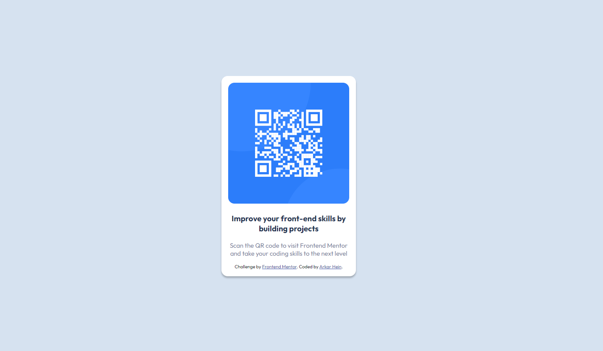

# Frontend Mentor - QR code component solution

This is a solution to the [QR code component challenge on Frontend Mentor](https://www.frontendmentor.io/challenges/qr-code-component-iux_sIO_H). Frontend Mentor challenges help you improve your coding skills by building realistic projects. 

## Table of contents

- [Overview](#overview)
  - [Screenshot](#screenshot)
  - [Links](#links)
- [My process](#my-process)
  - [Built with](#built-with)
  - [What I learned](#what-i-learned)
  - [Continued development](#continued-development)
  - [Useful resources](#useful-resources)
- [Author](#author)
- [Acknowledgments](#acknowledgments)

**Note: Delete this note and update the table of contents based on what sections you keep.**

## Overview

### Screenshot

### Links

- Solution URL: [https://github.com/ArkarHein44/QR_code_component_challenge](https://github.com/ArkarHein44/QR_code_component_challenge)
- Live Site URL: [https://qr-code-component-challenge-three.vercel.app](qr-code-component-challenge-three.vercel.app)

## My process
  1st I made a container with card, in card img, h3 and p tag with HTML.
  ##for responsive set body as min-height to 100vh and height to 100%.
  2nd I sent container to the center of body.
  3rd finished design.

### Built with
- Semantic HTML5 markup
- CSS custom properties
- Flexbox
- CSS Grid

### What I learned
i learned how to center a div vertically and horizontally.

### Continued development
-

### Useful resources
-

## Author

- Github- [Arkar Hein](https://github.com/ArkarHein44)
- Frontend Mentor - [@yourusername](https://www.frontendmentor.io/profile/yourusername)

## Acknowledgments

-
